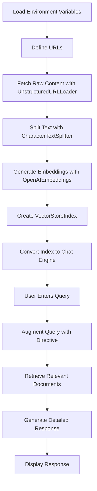

# Chatbot for Data Science & Machine Learning Query Answering

This project implements an interactive chatbot application using [Streamlit](https://streamlit.io) as the front-end interface. It leverages advanced open-source libraries including Llama Index, LangChain, and OpenAI models to provide detailed, citation-enriched responses to queries in the data science and machine learning domains.

**Repository:** [manuml1312/Chatbot](https://github.com/manuml1312/Chatbot)

## Table of Contents

- [Overview](#overview)
- [Key Features](#key-features)
- [Technology Stack](#technology-stack)
- [How It Works](#how-it-works)
- [Flowchart Diagram](#flowchart-diagram)
- [Setup & Installation](#setup--installation)
- [Usage](#usage)
- [Environment Variables](#environment-variables)
- [Future Enhancements](#future-enhancements)
- [License](#license)
- [Acknowledgements](#acknowledgements)

## Overview

The chatbot is designed to help users obtain comprehensive responses to technical queries related to data science and machine learning. The application works by:

- Loading documents from specified URLs using LangChain's UnstructuredURLLoader.
- Splitting and preprocessing the fetched text with a CharacterTextSplitter.
- Creating a vector index from the documents via Llama Index to enable semantic search.
- Utilizing OpenAI embeddings for document representation.
- Engaging a chatbot powered by OpenAI’s GPT-3.5-turbo model with a custom system prompt to act as an expert.
- Providing detailed, citation-enriched responses to user queries.

## Key Features

- **Interactive Chat Interface:** Built with Streamlit for real-time interactions.
- **Dynamic Document Loading:** Retrieves and processes textual data from URLs.
- **Semantic Search:** Uses vector indexing to fetch relevant documents.
- **Expert Response Generation:** Leverages GPT-3.5-turbo with a tailored system prompt.
- **Citation-Enriched Answers:** Augments responses with relevant citations and detailed information.

## Technology Stack

- **Frontend:** Streamlit
- **Document Processing:** 
  - LangChain (UnstructuredURLLoader, CharacterTextSplitter)
  - Llama Index (VectorStoreIndex, ServiceContext)
- **Language Modeling:** OpenAI GPT-3.5-turbo
- **Embeddings:** OpenAIEmbeddings from langchain_community.embeddings

## How It Works

1. **Environment Setup:**  
   The application loads the OpenAI API key from Streamlit's secrets.
2. **Document Loading & Preprocessing:**  
   A list of URLs (e.g., `https://soothsayeranalytics.com`) is provided. The UnstructuredURLLoader fetches the raw content, which is then split into smaller text chunks using the CharacterTextSplitter.
3. **Vector Index Creation:**  
   OpenAIEmbeddings convert the text chunks into vector embeddings. A VectorStoreIndex is created for semantic search.
4. **Chat Engine Initialization:**  
   The index is converted into a chat engine (using a "condense_question" mode) and stored in session state.
5. **Query Handling:**  
   Users enter queries in the Streamlit UI. The query is augmented with a directive to provide citations and detailed explanations. The chat engine retrieves relevant documents and uses GPT-3.5-turbo to generate a detailed answer, which is then displayed.

## Flowchart Diagram

Below is a multi-line flowchart diagram illustrating the key components and data flow:



## Setup & Installation

1. **Clone the Repository:**
   ```bash
   git clone https://github.com/manuml1312/Chatbot.git
   cd Chatbot
   ```

2. **Create a Virtual Environment:**
   ```bash
   python -m venv venv
   source venv/bin/activate  # On Windows: venv\Scripts\activate
   ```

3. **Install Dependencies:**
   ```bash
   pip install -r requirements.txt
   ```

4. **Configure Environment Variables:**
   Create a `.streamlit/secrets.toml` file with:
   ```toml
   [secrets]
   openai_key = "YOUR_OPENAI_API_KEY"
   ```

## Usage

1. Run the Streamlit application:
   ```bash
   streamlit run app.py
   ```
2. Open the provided local URL in your browser.
3. Enter your query in the text input field.
4. The chatbot will respond with a detailed, citation-enriched answer.

## Environment Variables

- **openai_key:** Your OpenAI API key, securely stored via Streamlit secrets.

## Future Enhancements

- **Expand Document Sources:** Load additional URLs or local files.
- **Enhanced Query Conditioning:** Further improve prompt engineering.
- **User Feedback Mechanism:** Implement a rating system for responses.
- **Scalable Deployment:** Explore containerized deployment (e.g., Docker).
- **Multimodal Integration:** Add support for images and other media.

## License

This project is licensed under the MIT License.

## Acknowledgements

This project uses open-source libraries and APIs including Streamlit, Llama Index, LangChain, and OpenAI. Special thanks to their developers and contributors.
``` 
